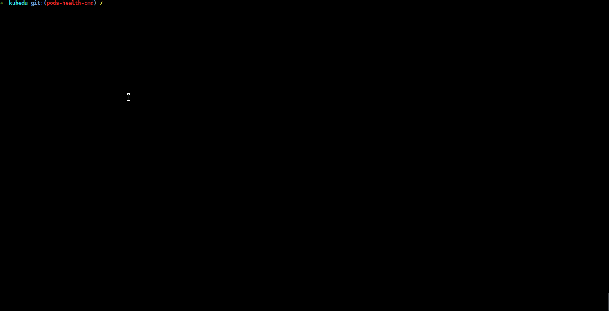

# podschecker
podschecker is a simple script thats check your pods health on your terminal, it can send x11 notifications


### Setup

```bash
curl https://raw.githubusercontent.com/hatembentayeb/podschecker/master/podschecker.sh --output podschecker.sh
chmod +x podschecker.sh
```
### Usage

```bash 
➜   ./notify_unhealthy_pods.sh

Sit Down and Wait  😂 :

busybox ... OK!
nginx ... OK!
nginx22 ... OK!
nginxerr ... Oh Shit !

STATS:

+---------------+---------------+
|Healthy Pods   |Unhealthy Pods |
+---------------+---------------+
|1              |3              |
+---------------+---------------+

```